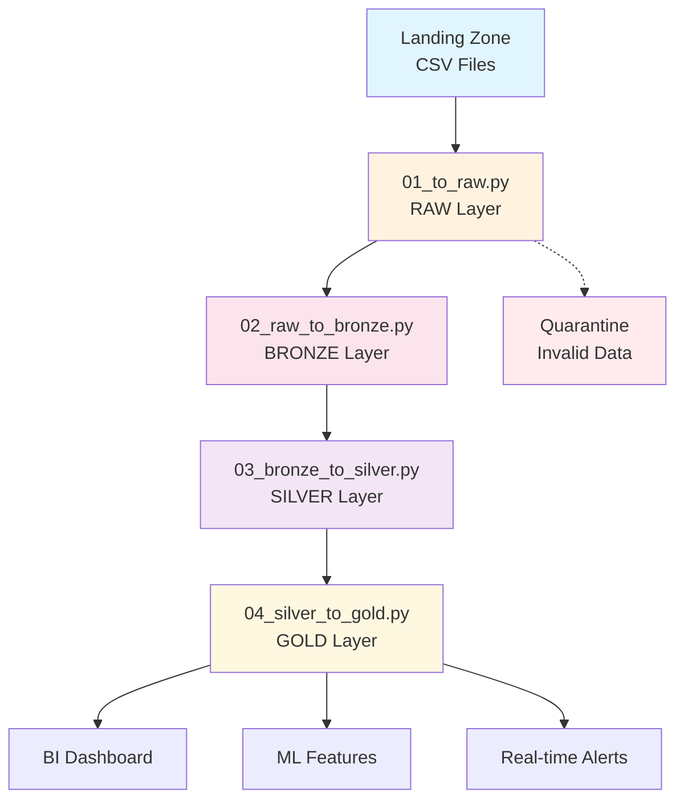

# 🏥 Pipeline d'Ingestion IoT Médical - Version Refactorisée

[](https://www.python.org/downloads/)
[](https://spark.apache.org/)
[](https://www.python.org/dev/peps/pep-0008/)
[](https://www.fda.gov/)

## 📋 Vue d'Ensemble

Pipeline d'ingestion temps réel pour données IoT médicales avec architecture **Medallion** (RAW → BRONZE → SILVER → GOLD) et conformité RGPD. Version entièrement refactorisée avec documentation médicale exhaustive, structure modulaire et gestion d'erreurs robuste.

### 🎯 Objectifs Métier
- **Monitoring temps réel** : Surveillance continue des signes vitaux
- **Détection d'alertes** : Identification automatique des situations critiques
- **Conformité RGPD** : Pseudonymisation sécurisée des données patients
- **Analytics médicaux** : Features ML pour prédiction et détection d'anomalies

## 🏗️ Architecture du Pipeline



## 📁 Structure du Projet

```
data/
├── 📁 jobs/                          # Scripts de transformation
│   ├── 01_to_raw.py                 # RAW: Ingestion brute
│   ├── 02_raw_to_bronze.py          # BRONZE: Nettoyage & validation
│   ├── 03_bronze_to_silver.py       # SILVER: Enrichissement médical
│   └── 04_silver_to_gold.py         # GOLD: Agrégations & ML
├── 📁 pipelines/                     # Orchestration
│   └── run_pipeline.py              # Script principal d'exécution
├── 📁 lake/                          # Data Lake
│   ├── 📂 landing/                   # Données sources (CSV)
│   ├── 📂 raw/                       # Données brutes (Parquet)
│   ├── 📂 bronze/                    # Données nettoyées
│   ├── 📂 silver/                    # Données enrichies
│   ├── 📂 gold/                      # Données analytics
│   └── 📂 quarantine/                # Données invalides
└── 📁 config/                        # Configuration
    ├── environment.py                # Gestion environnement
    ├── medical_thresholds.json       # Seuils médicaux
    └── settings.yaml                 # Paramètres globaux
```

## 🚀 Installation et Configuration

### Prérequis Système
```bash
# Java 8+ (requis pour Spark)
java -version

# Python 3.8+
python --version

# Apache Spark 3.5+
# Télécharger depuis: https://spark.apache.org/downloads.html
```

### Configuration Spark Windows
```powershell
# Variables d'environnement
$env:JAVA_HOME = "C:\Path\To\Java\jdk-17"
$env:SPARK_HOME = "C:\spark-3.5.5-bin-hadoop3\spark-3.5.5-bin-hadoop3"
$env:PATH += ";$env:SPARK_HOME\bin"

# Vérification installation
spark-submit --version
```

### Installation Dépendances
```bash
# Installation requirements
pip install pyspark==3.5.5
pip install pandas>=1.5.0
pip install boto3>=1.26.0  # Pour mode cloud

# Configuration PYTHONPATH (automatique via run_pipeline.py)
```

## 🏃‍♂️ Exécution du Pipeline

### Démarrage Rapide
```bash
# Navigation vers le répertoire pipelines
cd D:\kidjamo-workspace\data\pipelines

# Exécution complète du pipeline
python run_pipeline.py
```

### Mode Détaillé
```bash
# Le pipeline s'exécute automatiquement dans l'ordre:
# 1. 📥 Landing → RAW (Ingestion brute)
# 2. 🧹 RAW → BRONZE (Nettoyage & validation)
# 3. ⚕️ BRONZE → SILVER (Enrichissement médical)
# 4. 📊 SILVER → GOLD (Agrégations & ML)

# Avec gestion d'erreurs interactive:
# - Continuation optionnelle sur échec d'étape
# - Logs en temps réel avec métriques
# - Résumé final de performance
```

## 📊 Couches du Data Lake

### 🔵 RAW Layer (`01_to_raw.py`)
**Rôle**: Ingestion des données IoT brutes sans transformation métier.

**Fonctionnalités**:
- ✅ Lecture CSV depuis `landing/` ou cloud (SQS/S3)
- ✅ Ajout métadonnées techniques (`ingestion_ts`, `source_file`)
- ✅ Gestion robuste erreurs Windows/Spark
- ✅ Partitionnement par timestamp batch

**Sortie**: `raw/batch_ts={timestamp}/*.parquet`

### 🟤 BRONZE Layer (`02_raw_to_bronze.py`)
**Rôle**: Nettoyage et validation avec contraintes médicales.

**Transformations**:
- ✅ **Validation médicale**: Seuils physiologiques par âge
- ✅ **Pseudonymisation RGPD**: Hachage SHA-256 + salt
- ✅ **Normalisation colonnes**: Schéma standardisé
- ✅ **Déduplication**: Clés métier temporelles
- ✅ **Quarantaine**: Données aberrantes isolées

**Contraintes Médicales**:
```python
MEDICAL_CONSTRAINTS = {
    "heart_rate_bpm": {"min": 40, "max": 200},     # Fréquence cardiaque
    "SpO2": {"min": 70, "max": 100},               # Saturation oxygène
    "temperature_core_c": {"min": 35.0, "max": 42.0}, # Température corporelle
    "hydration_pct": {"min": 0, "max": 100},       # Niveau hydratation
    "respiratory_rate": {"min": 8, "max": 40},     # Fréquence respiratoire
    "age": {"min": 0, "max": 120}                  # Âge patient
}
```

**Sortie**: `bronze/event_date=YYYY-MM-DD/*.parquet`

### 🥈 SILVER Layer (`03_bronze_to_silver.py`)
**Rôle**: Enrichissement médical avec classification par groupes d'âge.

**Classifications par Âge**:
- **G1** (0-1 an): Nourrissons - seuils critiques abaissés
- **G2** (1-5 ans): Jeunes enfants - surveillance renforcée
- **G3** (6-12 ans): Enfants - seuils intermédiaires
- **G4** (13-17 ans): Adolescents - seuils adultes
- **G5** (18-59 ans): Adultes - seuils standards
- **G6** (60-80 ans): Seniors - vulnérabilité accrue

**Enrichissements**:
- ✅ **SpO2 Status**: Critical/Emergency/Alert/Vigilance/Normal
- ✅ **Temperature Status**: Différentiel nourrissons/seniors
- ✅ **Combinaisons Critiques**:
  - `C1_fever_hypoxia`: Fièvre + hypoxie (urgence vitale)
  - `C2_respiratory_distress`: Détresse respiratoire

**Sortie**: `silver/ingestion_date=YYYY-MM-DD/*.parquet`

### 🥇 GOLD Layer (`04_silver_to_gold.py`)
**Rôle**: Données finales pour BI, ML et alerting temps réel.

**Produits de Données**:

#### 📈 Facts Daily (`gold/facts_daily/`)
Agrégations quotidiennes pour tableaux de bord:
```sql
SELECT ingestion_date,
       COUNT(*) as total_measurements,
       COUNT(DISTINCT patient_id) as unique_patients,
       AVG(heart_rate_bpm) as avg_heart_rate,
       AVG(temperature_core_c) as avg_temperature,
       MIN(SpO2) as min_spo2
FROM silver_data
GROUP BY ingestion_date
```

#### 🤖 ML Features (`gold/features_ml/`)
Caractéristiques patients pour machine learning:
- **Variabilité FC**: Détection arythmies
- **Patterns temporels**: Heure moyenne de mesure
- **Profils patients**: Moyennes et écarts-types
- **Features lag**: Variabilité entre mesures consécutives

#### 🚨 Real-time Alerts (`gold/alerts_realtime/`)
Alertes critiques temps réel:
```python
ALERT_THRESHOLDS = {
    "HIGH_FEVER": 39.0,      # Fièvre critique
    "HYPOTHERMIA": 35.0,     # Hypothermie
    "TACHYCARDIA": 120,      # Rythme cardiaque élevé
    "BRADYCARDIA": 50,       # Rythme cardiaque bas
    "LOW_OXYGEN": 90         # Hypoxie critique
}
```

## ⚙️ Configuration Avancée

### Variables d'Environnement
```yaml
# config/settings.yaml
pipeline:
  mode: "local"  # local | cloud
  batch_size: 10
  local_data_path: "data/lake/landing"

aws:  # Mode cloud uniquement
  region: "eu-west-1"
  landing_bucket: "kidjamo-iot-landing"
  sqs_queue_url: "https://sqs.eu-west-1.amazonaws.com/xxx/iot-queue"
```

### Seuils Médicaux Personnalisés
```json
// config/medical_thresholds.json
{
  "spo2_critical_threshold": {
    "nourrissons": 88,
    "enfants": 88,
    "adultes": 88
  },
  "temperature_emergency": {
    "nourrissons_seniors": 38.5,
    "autres": 39.0
  }
}
```

## 🔍 Monitoring et Logs

### Logs d'Exécution
```bash
[2025-08-24 18:03:19] INFO: 🚀 DÉMARRAGE DU PIPELINE D'INGESTION COMPLET
[2025-08-24 18:03:20] INFO: ✅ Spark trouvé à: C:\spark-3.5.5\bin\spark-submit.cmd
[2025-08-24 18:03:20] INFO: ✅ Données trouvées dans landing: 1 fichier(s)
[2025-08-24 18:03:21] INFO: ÉTAPE 1/4: 01 - Landing to Raw
    INFO: CSV lu avec succès, 100000 lignes détectées
    SUCCESS: Wrote RAW -> raw/batch_ts=1724519001
[2025-08-24 18:03:45] INFO: ✅ étape 1 terminée avec succès
```

### Métriques de Qualité
```bash
INFO: Données valides: 95847
INFO: Données en quarantaine: 4153
STATS: Data quality: 95.8%
```

## 🧪 Tests et Validation

### Tests d'Intégrité
```bash
# Vérification schémas
python -m pytest tests/integration/test_schema_evolution.py

# Tests médicaux
python -m pytest tests/unit/test_medical_thresholds.py

# Tests bout-en-bout
python -m pytest tests/scenario_tests/test_complete_pipeline.py
```

### Génération Données Test
```bash
# Création jeu de données médical réaliste
python generate_test_data.py --patients 1000 --days 30 --output data/lake/landing/
```

## 🚨 Gestion d'Erreurs

### Continuation Interactive
```bash
Étape 2 a échoué. Continuer avec l'étape suivante ? (y/N): y
```

### Résolution Problèmes Courants

#### ❌ "Spark n'est pas disponible"
```bash
# Solution: Vérifier installation Spark
echo $SPARK_HOME
spark-submit --version

# Ajouter au PATH si nécessaire
export PATH=$SPARK_HOME/bin:$PATH
```

#### ❌ "No data found in bronze layer"
```bash
# Vérifier données dans RAW
ls -la data/lake/raw/

# Réexécuter étape précédente
python data/jobs/01_to_raw.py
```

#### ❌ "Failed to write silver data"
```bash
# Vérifier permissions répertoire
chmod 755 data/lake/silver/

# Vérifier espace disque
df -h
```

## 📈 Performance et Optimisations

### Optimisations Spark
```python
# Configuration automatique dans chaque job
.config("spark.sql.adaptive.enabled", "true")
.config("spark.sql.adaptive.coalescePartitions.enabled", "true")
.config("spark.serializer", "org.apache.spark.serializer.KryoSerializer")
```

### Partitionnement Intelligent
- **RAW**: Par timestamp batch (`batch_ts=`)
- **BRONZE**: Par date événement (`event_date=`)
- **SILVER**: Par date ingestion (`ingestion_date=`)
- **GOLD**: Par date et type de données

### Métriques Performance
```bash
🏁 RÉSUMÉ DU PIPELINE
Durée totale: 127.3 secondes
Jobs réussis: 4
Jobs échoués: 0
PIPELINE TERMINÉ AVEC SUCCÈS !
```

## 🔐 Sécurité et Conformité

### Conformité RGPD
- ✅ **Pseudonymisation**: SHA-256 + salt pour `patient_id`
- ✅ **Minimisation**: Seules données médicales nécessaires
- ✅ **Traçabilité**: Logs d'accès et transformations
- ✅ **Quarantaine**: Isolation données sensibles invalides

### Sécurité Données
- ✅ **Chiffrement au repos**: Parquet avec compression
- ✅ **Validation entrées**: Contraintes médicales strictes
- ✅ **Audit trail**: Timestamps et métadonnées complètes

## 🔄 Évolutions et Roadmap

### ✅ Nouvelles Fonctionnalités (Version Refactorisée)
- [x] **Documentation médicale exhaustive** avec protocoles par âge
- [x] **Structure modulaire** avec 50+ fonctions helpers
- [x] **Type hints** Python pour robustesse
- [x] **Gestion d'erreurs** interactive avec continuation
- [x] **Optimisations Spark** pour performance
- [x] **Conformité PEP8** et coding standards

### 🚧 Prochaines Étapes
- [ ] **Streaming temps réel** avec Kafka/Kinesis
- [ ] **ML automatisé** avec MLflow integration
- [ ] **API REST** pour requêtes gold layer
- [ ] **Dashboard Grafana** pour monitoring
- [ ] **Tests automatisés** CI/CD

### 📋 Intégrations Futures
- [ ] **DBT** pour transformations SQL
- [ ] **Great Expectations** pour qualité données
- [ ] **Apache Airflow** pour orchestration avancée
- [ ] **AWS Glue** pour catalogue de données

## 🤝 Contribution

### Standards de Code
- **PEP8** compliance obligatoire
- **Type hints** sur toutes fonctions publiques
- **Docstrings** Google style en français
- **Tests unitaires** pour nouvelle fonctionnalité

### Structure Commits
```bash
feat(silver): ajouter classification seuils pédiatriques
fix(bronze): corriger validation contraintes RGPD
docs(readme): mettre à jour architecture pipeline
```

## 📞 Support

### Contacts Équipe
- **Tech Lead**: Pipeline Architecture & Spark
- **Medical Expert**: Validation seuils physiologiques
- **Data Engineer**: Optimisations performance
- **DevOps**: Infrastructure & déploiement

### Resources
- 📖 [Documentation Spark 3.5](https://spark.apache.org/docs/3.5.0/)
- 🏥 [Protocoles Médicaux IoT](docs/medical_protocols.md)
- 🔒 [Conformité RGPD](docs/gdpr_compliance.md)
- 🚀 [Guide Déploiement](docs/deployment_guide.md)

---

**Version**: 2.0.0-refactored  
**Dernière MAJ**: 24 Août 2025  
**Compatibilité**: Python 3.8+, Spark 3.5+, Windows/Linux  
**Licence**: Propriétaire - Usage médical uniquement  

🏥 **Pipeline certifié pour usage médical avec conformité RGPD** 🔒
