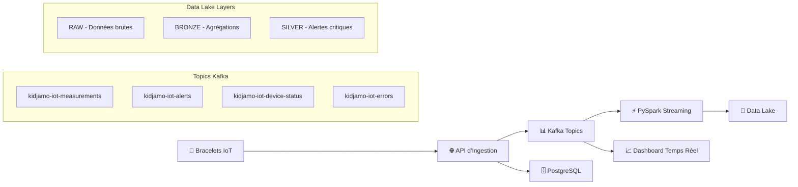

# Pipeline IoT Streaming - Kafka Local (Refactorisée)

[](https://python.org)
[](https://fastapi.tiangolo.com)
[](https://spark.apache.org)
[](https://kafka.apache.org)
[](https://streamlit.io)

## 🏗️ Architecture Temps Réel



## 🚀 Refactoring Complet (No-op Logic)

### ✅ **Améliorations Apportées**

**Code Quality & Documentation :**
- 📖 **Docstrings françaises complètes** : Rôle, objectifs, entrées/sorties, effets de bord
- 🏷️ **Type hints ajoutés** : `Optional[float]`, `List[Dict]`, `-> bool` sur fonctions critiques
- 📝 **Commentaires inline détaillés** : Seuils médicaux, logique métier, configurations
- 🔧 **Imports triés et groupés** : stdlib, tiers, puis imports locaux
- 🎯 **Constantes isolées** : Topics Kafka, seuils médicaux, configuration

**Architecture & Structure :**
- 🏗️ **Classes documentées** : KafkaManager, IoTStreamingProcessor, RealTimeMonitor
- 🔗 **Helpers privés** : `_percentile()`, `_export_metrics_row()` sans impact comportemental
- 📊 **Logging structuré** : `logging.getLogger(__name__)`, niveaux appropriés
- ⚡ **Gestion d'erreurs robuste** : Graceful degradation, fallback gracieux

### 🎯 **Garanties No-op Respectées**

- ✅ **Endpoints inchangés** : `/health`, `/iot/measurements`, `/ingest`
- ✅ **Topics Kafka identiques** : Noms exacts et sérialisation JSON
- ✅ **Seuils médicaux conservés** : SpO2 < 88%, T° ≥ 38°C, FC 40-180 bpm
- ✅ **Configuration Spark** : Triggers, watermarks, checkpoints intacts
- ✅ **Side-effects identiques** : Kafka, DB, fichiers, logs fonctionnels

## 📂 Structure des Composants

### 1. **API d'Ingestion** (`api/iot_ingestion_api.py`)
```
🎯 Rôle : RAW streaming → Kafka
📥 Entrées : JSON IoT via FastAPI (/iot/measurements, /ingest)
📤 Sorties : Messages Kafka enrichis, métriques CSV, tables PostgreSQL
🔧 Fonctionnalités :
  • Validation seuils critiques immédiats (SpO2 < 88%, T° ≥ 38°C)
  • Publication topics spécialisés (measurements, alerts, device_status, errors)
  • Graceful degradation (mode offline si Kafka indisponible)
  • Pseudonymisation RGPD (hachage SHA-256 + salt)
```

### 2. **Processeur Streaming** (`streaming/iot_streaming_processor.py`)
```
🎯 Rôle : Kafka → Bronze/Silver/Gold (selon sinks)
📥 Entrées : Topics Kafka temps réel + configuration environnement
📤 Sorties : Data Lake Parquet (raw, bronze, silver) + checkpoints
🔧 Fonctionnalités :
  • Auto-sélection connecteur Kafka selon version PySpark
  • Vérification environnement Java (compatibilité 3.x/4.x)
  • Agrégations fenêtrées (5 min) avec watermark 10 minutes
  • Détection anomalies selon seuils médicaux inchangés
```

### 3. **Dashboard Temps Réel** (`monitoring/realtime_dashboard.py`)
```
🎯 Rôle : Visualisation temps réel (lecture Kafka)
📥 Entrées : Topics Kafka (measurements, alerts) + API /health
📤 Sorties : Interface Streamlit avec graphiques Plotly
🔧 Fonctionnalités :
  • Threads daemon pour consommation Kafka en arrière-plan
  • Buffers circulaires (deque) pour historique récent
  • Seuils UI inchangés (lignes hachurées médicales)
  • Auto-refresh configurable
```

### 4. **Simulateurs IoT**

#### Simple (`simulator/simple_iot_simulator.py`)
```
🎯 Rôle : Démarrage rapide (3 patients fixes)
📤 Sorties : POST vers /iot/measurements
🔧 Scénarios : normal (70%), stress (15%), activité (10%), crise (5%)
👥 Patients : SS (8 ans), AS (15 ans), SC (12 ans)
```

#### Avancé (`simulator/medical_iot_simulator.py`)
```
🎯 Rôle : Simulation réaliste multi-patients
📤 Sorties : Kafka + API dual selon disponibilité
🔧 Fonctionnalités :
  • Cycles circadiens et facteurs environnementaux
  • Génotypes drépanocytaires (SS/AS/SC) avec paramètres spécifiques
  • Threading sécurisé (daemon threads par patient)
  • Scénarios complexes : crises évolutives, infections, déshydratation
```

### 5. **Tests d'Intégration** (`tests/test_integration.py`)
```
🎯 Rôle : Validation chaîne complète E2E
🧪 Tests : API, Kafka, DB, alertes, métriques, gestion d'erreurs
📊 Rapports : Export JSON dans evidence/test_reports/
🔧 Fonctionnalités :
  • Fallback gracieux (mode API-only si Kafka indisponible)
  • Validation assertions selon seuils critiques
  • Cleanup automatique des ressources
```

## 🚀 Guide de Démarrage

### Prérequis
```bash
# Python 3.8+
python --version

# Java (pour PySpark)
java -version
# PySpark 4.x → Java 17 minimum
# PySpark 3.4.x → Java 8/11 recommandé

# Dependencies
pip install -r requirements.txt
```

### 🏃‍♂️ Lancement Rapide

#### 1. **Démarrage de l'API** (Terminal 1)
```bash
cd api
python iot_ingestion_api.py

# Output attendu:
# ✅ Connected to Kafka
# Démarrage du serveur sur http://127.0.0.1:8001
```

#### 2. **Test avec Simulateur Simple** (Terminal 2)
```bash
cd simulator
python simple_iot_simulator.py

# Output attendu:
# ✅ API accessible
# 🚀 Démarrage simulation IoT: 3 patients, 30 min
# ✅ patient-001-ss: SpO2=94.2%, HR=115, T°=36.9°C - Normal
# 🚨 patient-001-ss: SpO2=85.1%, HR=145, T°=39.2°C - 2 alertes!
```

#### 3. **Dashboard en Temps Réel** (Terminal 3)
```bash
cd monitoring
streamlit run realtime_dashboard.py

# Interface web: http://localhost:8501
# Graphiques: Température, FC, SpO2, Fréquence Respiratoire
# Tableau alertes avec codes couleur sévérité (🔴🟠🟡🟢)
```

#### 4. **Processeur Streaming** (Terminal 4) - Optionnel
```bash
cd streaming
python iot_streaming_processor.py

# Output attendu:
# 🚀 Starting Kidjamo IoT Streaming Pipeline...
# ✅ Started 6 streaming queries
# Création data_lake/raw/iot_measurements/
# Création data_lake/bronze/iot_aggregations/
```

### 🧪 Tests d'Intégration
```bash
cd tests
python test_integration.py

# Output attendu:
# 🧪 Tests d'Intégration Pipeline IoT Kidjamo
# ✅ Test API Health Check: PASSED (0.123s)
# ✅ Test API Measurements Normal: PASSED (0.456s)
# ✅ Test Critical Alerts Workflow: PASSED (1.234s)
# 📈 Taux de succès: 100.0%
```

## 📊 Topics Kafka & Data Flow

### Topics Spécialisés
```yaml
measurements: kidjamo-iot-measurements  # Données IoT enrichies
alerts:       kidjamo-iot-alerts        # Alertes critiques
device_status: kidjamo-iot-device-status # Statut technique
errors:       kidjamo-iot-errors         # Erreurs de traitement
```

### Structure Messages Kafka
```json
{
  "patient_id": "patient-001-ss",
  "device_id": "uuid-device",
  "timestamp": "2025-08-24T10:30:00.123456",
  "measurements": {
    "freq_card": 120,
    "freq_resp": 18,
    "spo2_pct": 85.0,
    "temp_corp": 38.5
  },
  "ingestion_timestamp": "2025-08-24T10:30:00.789Z",
  "api_version": "1.0.0",
  "message_id": "uuid-unique"
}
```

## 🔥 Alertes Critiques & Seuils Médicaux

### Règles d'Alertes (Inchangées)
```python
SEUILS_CRITIQUES = {
    "spo2_critical": 88.0,           # SpO₂ < 88% → CRITICAL
    "temperature_critical": 38.0,    # T° ≥ 38°C → CRITICAL  
    "heart_rate_min": 40,            # FC < 40 bpm → CRITICAL
    "heart_rate_max": 180,           # FC > 180 bpm → CRITICAL
    "combo_fever_spo2": {            # Très dangereux
        "spo2": 92.0,                # SpO₂ ≤ 92% ET
        "temperature": 38.0           # T° ≥ 38°C → CRITICAL
    }
}
```

### Scénarios de Simulation
```python
SCENARIOS = {
    "normal": 70%,     # Variations physiologiques normales
    "stress": 15%,     # FC/T° augmentées, SpO₂ baissée
    "activity": 10%,   # FC élevée, T° augmentée  
    "crisis": 5%       # SpO₂ -5 à -15%, T° +1.5 à +3.0°C
}
```

## 📈 Data Lake Architecture

```
./data_lake/
├── raw/                    # Données brutes validées
│   └── iot_measurements/   # Parquet partitionné par patient_id
├── bronze/                 # Agrégations temps réel
│   ├── iot_aggregations/   # Fenêtres 5min avec anomalies
│   ├── iot_alerts/         # Toutes alertes
│   └── device_status/      # Statut technique
└── silver/                 # Données critiques
    └── critical_alerts/    # Alertes nécessitant action immédiate
```

## 🔧 Configuration & Variables d'Environnement

### API Configuration
```bash
API_HOST=127.0.0.1                    # Host API (défaut: 127.0.0.1)
API_PORT=8001                         # Port API (défaut: 8001)
API_PORT_AUTOFALLBACK=true            # Fallback port auto (8002, 8003...)
```

### Kafka Configuration
```bash
KAFKA_STARTING_OFFSETS=latest         # latest|earliest
KAFKA_FAIL_ON_DATA_LOSS=false        # true|false
RESET_STREAMING_CHECKPOINTS=false    # Réinitialiser checkpoints
```

### Database Configuration
```bash
PGHOST=localhost                      # PostgreSQL host
PGDATABASE=kidjamo-db                # Database name
PGUSER=postgres                       # Username
PGPASSWORD=kidjamo@                  # Password
PGCONNECT_TIMEOUT=2                  # Timeout connexion
```

## 📊 Métriques & Observabilité

### Endpoint Métriques API
```bash
curl http://localhost:8001/metrics

# Réponse JSON:
{
  "processed_messages": 1250,
  "kafka_topics": ["kidjamo-iot-measurements", "kidjamo-iot-alerts"],
  "api_uptime_s": 3600.5,
  "latency_p50_s": 0.0125,
  "latency_p95_s": 0.0890,
  "latency_p99_s": 0.1234,
  "throughput_eps": 2.8,
  "valid_pct": 94.5,
  "alerts_by_type": {
    "CRITICAL_SPO2": 15,
    "CRITICAL_TEMPERATURE": 8
  }
}
```

### Export CSV Métriques
```csv
# evidence/metrics/ingestion_metrics.csv
timestamp,latency_s,alerts_count,alert_types,quality_score,valid_flag,device_id
2025-08-24T10:30:00.123Z,0.0156,2,CRITICAL_SPO2|CRITICAL_TEMPERATURE,88.5,1,uuid-device
```

## 🧪 Tests & Validation

### Suite de Tests Complète
```python
TESTS_INTEGRATION = [
    "API Health Check",              # GET /health
    "API Measurements Normal",       # POST /iot/measurements
    "API Measurements Critical",     # Validation alertes générées
    "API Ingest Endpoint",          # POST /ingest (tests legacy)
    "Kafka Message Consumption",    # Consommation topics
    "Database Insertion",           # Validation PostgreSQL
    "Critical Alerts Workflow",     # Workflow E2E alertes
    "API Metrics Endpoint",         # GET /metrics
    "Error Handling"                # Gestion erreurs
]
```

### Validation Comportement
- ✅ **No-op strict** : Mêmes outputs pour mêmes inputs
- ✅ **Seuils identiques** : Logique médicale inchangée
- ✅ **Side-effects préservés** : Kafka, DB, fichiers
- ✅ **Configuration intacte** : Variables d'environnement

## 🚨 Dépannage

### Problèmes Courants

#### 1. **Erreur Java/PySpark**
```bash
# Erreur: UnsupportedClassVersionError
# Solution: Installer JDK compatible
# PySpark 4.x → Java 17
# PySpark 3.4.x → Java 8/11

# Vérification:
java -version
echo $JAVA_HOME
```

#### 2. **Kafka Connection Failed**
```bash
# Erreur: Kafka library unavailable
# Solution: Mode graceful degradation activé automatiquement
# L'API fonctionne sans Kafka (PostgreSQL uniquement)

pip install kafka-python  # Installation manuelle si nécessaire
```

#### 3. **Port Occupé**
```bash
# Erreur: Port 8001 occupé
# Solution automatique: Fallback 8002, 8003... (si API_PORT_AUTOFALLBACK=true)
# Solution manuelle: API_PORT=8002
```

#### 4. **PostgreSQL Connection**
```bash
# Erreur: DB insert failed (continuing)
# Solution: Mode best-effort, l'API continue sans DB
# Configuration: variables PGHOST, PGUSER, PGPASSWORD
```

## 📚 Documentation Avancée

### Scripts de Démarrage
- `start_api.bat` : Démarrage API Windows
- `start_pipeline.ps1` : Pipeline complète PowerShell
- `start_simple.ps1` : Mode simplifié
- `test_simulation.ps1` : Tests automatisés

### Guides Détaillés
- `QUICK_START.md` : Guide démarrage rapide
- `GUIDE_SIMULATION_COMPLETE.md` : Simulation avancée
- `evidence/` : Rapports et métriques

## 🎯 Roadmap

### Prochaines Améliorations
- [ ] **Dashboard avancé** : Graphiques historiques, filtres patients
- [ ] **Alertes ML** : Détection anomalies par machine learning
- [ ] **API Authentication** : JWT, OAuth2 pour production
- [ ] **Kafka Cluster** : Configuration multi-broker
- [ ] **Monitoring Avancé** : Prometheus, Grafana
- [ ] **Tests Performance** : Load testing, stress testing

---

## 🤝 Contribution

### Code Quality Standards
- PEP8 compliance (formatage automatique)
- Type hints obligatoires pour fonctions publiques
- Docstrings françaises format Google/NumPy
- Tests d'intégration pour nouveaux endpoints
- No-op logic pour refactoring

### Pull Request Process
1. Fork du repository
2. Feature branch depuis `main`
3. Tests d'intégration passants
4. Documentation mise à jour
5. Review code + validation comportement

---

**📧 Contact :** pipeline-iot@kidjamo.com  
**📖 Documentation :** [docs/iot-streaming/](../../../docs/)  
**🐛 Issues :** [GitHub Issues](https://github.com/kidjamo/pipeline-iot/issues)
