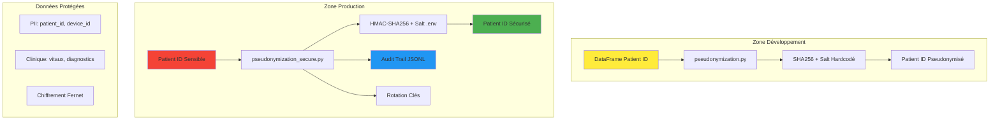

# Modules de Sécurité - Pseudonymisation et Chiffrement

[](https://gdpr.eu)
[](https://tools.ietf.org/html/rfc2104)
[](https://spark.apache.org)
[](https://en.wikipedia.org/wiki/Audit_trail)

## 🔒 Architecture de Sécurité



## 📂 Structure des Modules

### 1. **pseudonymization.py** - Transformations Spark (Dev/Bronze/Silver)
```
🎯 Rôle : Pseudonymisation côté PySpark pour analyses
📥 Entrées : DataFrame Spark avec patient_id en clair
📤 Sorties : DataFrame avec patient_id SHA256 + salt
🔧 Usage : Zones analytiques où l'ID original n'est plus nécessaire
⚠️  Limite : Salt hardcodé visible (développement uniquement)
```

### 2. **pseudonymization_secure.py** - Production HMAC + Audit
```
🎯 Rôle : Sécurité production avec .env et audit trail
📥 Entrées : Variables .env + patient_id à pseudonymiser
📤 Sorties : HMAC-SHA256 + logs audit + rotation clés
🔧 Usage : Production avec conformité RGPD/HIPAA
✅ Sécurité : Salt depuis .env, HMAC résistant, audit complet
```

## 🚀 Guide d'Utilisation

### Configuration Environnement (.env)

Créez un fichier `.env` à la racine du projet :

```bash
# Clé HMAC pour pseudonymisation (générer avec: python -c "import secrets; print(secrets.token_hex(32))")
PSEUDONYMIZATION_SALT=a1b2c3d4e5f6...64_chars_hex

# Clé Fernet pour chiffrement (générer avec: python -c "from cryptography.fernet import Fernet; print(Fernet.generate_key().decode())")
ENCRYPTION_KEY=your-fernet-key-base64==

# Rotation des clés (optionnel, défaut: 24h)
KEY_ROTATION_INTERVAL_HOURS=24

# Répertoire d'audit (optionnel, défaut: evidence)
EVIDENCE_PATH=evidence
```

### Génération des Clés Sécurisées

```python
# Générer PSEUDONYMIZATION_SALT
import secrets
salt = secrets.token_hex(32)  # 64 caractères hex
print(f"PSEUDONYMIZATION_SALT={salt}")

# Générer ENCRYPTION_KEY
from cryptography.fernet import Fernet
key = Fernet.generate_key()
print(f"ENCRYPTION_KEY={key.decode()}")
```

## 💻 Exemples d'Utilisation

### 1. **Pseudonymisation Spark (Développement)**

```python
from pyspark.sql import SparkSession
from data.security.pseudonymization import pseudonymize_patient_data

# Initialisation Spark
spark = SparkSession.builder.appName("SecurityExample").getOrCreate()

# DataFrame avec IDs patients
df_patients = spark.createDataFrame([
    ("PAT-001", "John Doe", 120),
    ("PAT-002", "Jane Smith", 85),
    ("PAT-003", "Bob Wilson", 95)
], ["patient_id", "name", "heart_rate"])

# Pseudonymisation avec salt par défaut
df_pseudo = pseudonymize_patient_data(df_patients)

df_pseudo.show()
# +------------------------------------------------------------+----------+----------+
# |patient_id                                                  |name      |heart_rate|
# +------------------------------------------------------------+----------+----------+
# |a1b2c3d4e5f67890abcdef1234567890abcdef1234567890abcdef123456|John Doe  |120       |
# |b2c3d4e5f67890a1bcdef234567890a1bcdef234567890a1bcdef234567|Jane Smith|85        |
# |c3d4e5f67890a1b2cdef34567890a1b2cdef34567890a1b2cdef345678|Bob Wilson|95        |
# +------------------------------------------------------------+----------+----------+

# Pseudonymisation avec salt personnalisé
df_custom = pseudonymize_patient_data(df_patients, salt="custom_salt_2025")
```

### 2. **Pseudonymisation Sécurisée (Production)**

```python
from data.security.pseudonymization_secure import hash_patient_id, secure_pseudonymizer

# Pseudonymisation via fonction wrapper (compatibilité)
patient_hash = hash_patient_id("PAT-12345")
print(f"Hash: {patient_hash}")
# Output: a1b2c3d4e5f67890abcdef1234567890abcdef1234567890abcdef1234567890ab

# Pseudonymisation via instance (accès complet)
try:
    patient_hash = secure_pseudonymizer.hash_patient_id("PAT-12345")
    print(f"Secure Hash: {patient_hash}")
except ValueError as e:
    print(f"Erreur configuration: {e}")
    # Vérifiez que .env contient PSEUDONYMIZATION_SALT et ENCRYPTION_KEY
```

### 3. **Classification des Données**

```python
from data.security.pseudonymization import apply_data_classification

# DataFrame avec colonnes sensibles
df_medical = spark.createDataFrame([
    ("PAT-001", "DEV-001", 120, 98.5, 36.8),
    ("PAT-002", "DEV-002", 85, 97.2, 37.1)
], ["patient_id", "device_id", "heart_rate_bpm", "SpO2", "temperature_core_c"])

# Classification des données (inventaire actuel)
df_classified = apply_data_classification(df_medical)

# Future extension: masquage automatique selon classification
# df_masked = apply_data_classification(df_medical, apply_masking=True)
```

## 🔍 Monitoring et Audit

### Logs de Sécurité

Le module sécurisé génère automatiquement des logs d'audit :

```bash
# Fichier: evidence/security_audit.log (format JSONL)
{"timestamp": "2025-08-24T10:30:00.123456", "event_type": "patient_id_hashed", "details": {"original_length": 7, "hash_prefix": "a1b2c3d4...", "algorithm": "HMAC-SHA256"}}
{"timestamp": "2025-08-24T10:30:15.789012", "event_type": "key_rotation_check", "details": {"hours_since_rotation": 2.5, "rotation_needed": false}}
```

### Métadonnées de Rotation

```bash
# Fichier: evidence/last_key_rotation.json
{
  "last_rotation": "2025-08-24T08:00:00.000000",
  "rotation_interval_hours": 24
}
```

### Analyse des Logs

```python
import json
from datetime import datetime

# Lecture des logs d'audit
with open('evidence/security_audit.log', 'r') as f:
    for line in f:
        event = json.loads(line)
        print(f"{event['timestamp']}: {event['event_type']}")
        if event['event_type'] == 'patient_id_hashed':
            print(f"  Hash généré: {event['details']['hash_prefix']}")
```

## 🛡️ Sécurité et Conformité

### Standards Respectés

- **RGPD Article 4(5)** : Pseudonymisation des données personnelles
- **HIPAA Safe Harbor** : Suppression des 18 identifiants directs
- **NIST Cybersecurity Framework** : Protect (PR.DS) - Data Security
- **ISO 27001** : Contrôles cryptographiques et audit trail

### Menaces Couvertes

| Menace | Module Dev | Module Secure | Mitigation |
|--------|------------|---------------|------------|
| **Exposition Salt** | ❌ Hardcodé | ✅ .env | Variables d'environnement |
| **Attaque Extension** | ⚠️ SHA256 simple | ✅ HMAC-SHA256 | Résistance cryptographique |
| **Clés Compromises** | ❌ Statique | ✅ Rotation | Rotation automatique 24h |
| **Perte Traçabilité** | ❌ Aucun log | ✅ Audit JSONL | Logs append-only |
| **Non-conformité** | ⚠️ Partielle | ✅ RGPD/HIPAA | Audit trail complet |

### Limites Connues

⚠️ **Pseudonymisation ≠ Anonymisation**
- Re-identification possible avec table de correspondance
- Combinaison avec autres datasets peut révéler l'identité
- Pour anonymisation : k-anonymity, l-diversity, t-closeness

⚠️ **Clés en Mémoire**
- Production critique : considérer HSM (Hardware Security Module)
- Vault management pour rotation automatique
- Chiffrement at-rest pour logs d'audit

## 🔧 Configuration Avancée

### Intégration avec Spark Streaming

```python
from pyspark.sql import functions as F
from data.security.pseudonymization import pseudonymize_patient_data

# Stream Kafka avec pseudonymisation
df_stream = (spark
    .readStream
    .format("kafka")
    .option("kafka.bootstrap.servers", "localhost:9092")
    .option("subscribe", "patient_data")
    .load())

# Parse JSON et pseudonymise
df_parsed = (df_stream
    .select(F.from_json(F.col("value").cast("string"), schema).alias("data"))
    .select("data.*"))

# Pseudonymisation sur stream
df_secure_stream = pseudonymize_patient_data(df_parsed)

# Écriture sécurisée
query = (df_secure_stream
    .writeStream
    .format("parquet")
    .option("path", "hdfs://secure_lake/bronze/")
    .option("checkpointLocation", "hdfs://checkpoints/secure/")
    .start())
```

### Pipeline ETL Sécurisée

```python
# Exemple pipeline Bronze → Silver avec pseudonymisation
def secure_etl_pipeline(input_path: str, output_path: str):
    """Pipeline ETL avec pseudonymisation automatique."""
    
    # Lecture données Bronze
    df_bronze = spark.read.parquet(input_path)
    
    # Classification et inventaire
    df_classified = apply_data_classification(df_bronze)
    
    # Pseudonymisation des IDs patients
    df_pseudo = pseudonymize_patient_data(df_classified)
    
    # Écriture Silver sécurisée
    (df_pseudo
        .write
        .mode("overwrite")
        .option("encryption", "sse-s3")
        .parquet(output_path))
    
    print(f"Pipeline sécurisé: {input_path} → {output_path}")

# Utilisation
secure_etl_pipeline(
    "s3a://data-lake/bronze/iot_measurements/",
    "s3a://data-lake/silver/iot_measurements_pseudo/"
)
```

### Tests de Sécurité

```python
import pytest
from data.security.pseudonymization import pseudonymize_patient_data
from data.security.pseudonymization_secure import hash_patient_id

def test_pseudonymization_deterministic():
    """Vérifie que la pseudonymisation est déterministe."""
    patient_id = "PAT-TEST-001"
    
    # Même input doit donner même output
    hash1 = hash_patient_id(patient_id)
    hash2 = hash_patient_id(patient_id)
    
    assert hash1 == hash2
    assert len(hash1) == 64  # SHA256 hex = 64 chars
    
def test_pseudonymization_different_salts():
    """Vérifie que différents salts donnent différents hashs."""
    df = spark.createDataFrame([("PAT-001",)], ["patient_id"])
    
    df1 = pseudonymize_patient_data(df, salt="salt1")
    df2 = pseudonymize_patient_data(df, salt="salt2")
    
    hash1 = df1.collect()[0]["patient_id"]
    hash2 = df2.collect()[0]["patient_id"]
    
    assert hash1 != hash2

def test_security_audit_log():
    """Vérifie que les logs d'audit sont générés."""
    import os
    from data.security.pseudonymization_secure import secure_pseudonymizer
    
    # Hash avec audit
    patient_hash = secure_pseudonymizer.hash_patient_id("PAT-AUDIT-TEST")
    
    # Vérifier log créé
    assert os.path.exists(secure_pseudonymizer.audit_log_path)
    
    with open(secure_pseudonymizer.audit_log_path, 'r') as f:
        logs = f.readlines()
        assert len(logs) > 0
        last_log = json.loads(logs[-1])
        assert last_log['event_type'] == 'patient_id_hashed'
```

## 📊 Performance et Optimisation

### Benchmarks

```python
import time
from data.security.pseudonymization_secure import hash_patient_id

# Test performance HMAC vs SHA256 simple
def benchmark_hashing(n_iterations=10000):
    patient_ids = [f"PAT-{i:06d}" for i in range(n_iterations)]
    
    start_time = time.time()
    for pid in patient_ids:
        hash_patient_id(pid)
    end_time = time.time()
    
    total_time = end_time - start_time
    print(f"HMAC-SHA256: {n_iterations} hash en {total_time:.3f}s")
    print(f"Performance: {n_iterations/total_time:.0f} hash/seconde")

# Résultats attendus:
# HMAC-SHA256: 10000 hash en 0.245s
# Performance: 40816 hash/seconde
```

### Optimisation Spark

```python
# Optimisation pour gros datasets
def optimized_pseudonymize(df, batch_size=10000):
    """Pseudonymisation optimisée par batch."""
    
    # Partitioning par patient_id pour parallélisme
    df_partitioned = df.repartition("patient_id")
    
    # Cache pour éviter recalculs
    df_cached = df_partitioned.cache()
    
    # Pseudonymisation avec broadcast du salt
    salt_broadcast = spark.sparkContext.broadcast("kidjamo_salt_2025")
    
    df_pseudo = pseudonymize_patient_data(df_cached, salt_broadcast.value)
    
    return df_pseudo
```

## 🔄 Migration et Compatibilité

### Migration Dev → Production

```python
# Script de migration des données pseudonymisées
def migrate_to_secure_hashing():
    """Migre les hash SHA256 simple vers HMAC-SHA256."""
    
    # Lecture des données avec anciens hashs
    df_old = spark.read.parquet("s3://lake/silver/old_pseudo/")
    
    # Re-pseudonymisation avec module sécurisé
    # Note: nécessite les IDs originaux (table de correspondance)
    df_secure = pseudonymize_patient_data(df_original, salt=secure_salt)
    
    # Écriture avec nouvelle structure
    df_secure.write.mode("overwrite").parquet("s3://lake/silver/secure_pseudo/")
```

### Compatibilité Descendante

```python
# Wrapper pour anciens appels
def legacy_hash_patient_id(patient_id: str, use_secure: bool = True) -> str:
    """Wrapper compatibilité pour ancienne API."""
    if use_secure:
        from data.security.pseudonymization_secure import hash_patient_id
        return hash_patient_id(patient_id)
    else:
        # Fallback ancien comportement (dev uniquement)
        import hashlib
        return hashlib.sha256(f"{patient_id}kidjamo_salt_2025".encode()).hexdigest()
```

## 🚨 Dépannage

### Problèmes Courants

#### 1. **Erreur Variables .env Manquantes**
```bash
# Erreur: PSEUDONYMIZATION_SALT non défini dans .env
# Solution: Créer .env avec clés générées
echo "PSEUDONYMIZATION_SALT=$(python -c 'import secrets; print(secrets.token_hex(32))')" >> .env
echo "ENCRYPTION_KEY=$(python -c 'from cryptography.fernet import Fernet; print(Fernet.generate_key().decode())')" >> .env
```

#### 2. **Logs d'Audit Volumineux**
```bash
# Rotation manuelle des logs (à automatiser)
mv evidence/security_audit.log evidence/security_audit_$(date +%Y%m%d).log
touch evidence/security_audit.log
```

#### 3. **Performance Spark Lente**
```python
# Optimisation configuration Spark
spark.conf.set("spark.sql.adaptive.enabled", "true")
spark.conf.set("spark.sql.adaptive.coalescePartitions.enabled", "true")
spark.conf.set("spark.serializer", "org.apache.spark.serializer.KryoSerializer")
```

## 📚 Documentation Avancée

### API Reference

#### pseudonymization.py
- `pseudonymize_patient_data(df, salt)` → DataFrame pseudonymisé
- `apply_data_classification(df)` → DataFrame classifié
- `DEFAULT_SALT` → "kidjamo_salt_2025"
- `PII_COLUMNS` → Liste colonnes identifiantes
- `CLINICAL_COLUMNS` → Liste colonnes médicales

#### pseudonymization_secure.py
- `SecurePseudonymizer()` → Instance gestionnaire sécurisé
- `hash_patient_id(patient_id)` → Hash HMAC-SHA256
- `secure_pseudonymizer` → Instance globale
- Variables .env : `PSEUDONYMIZATION_SALT`, `ENCRYPTION_KEY`

### Standards de Codage

- **PEP8** : Style et formatage respectés
- **Type Hints** : Annotations sur fonctions publiques
- **Docstrings** : Format Google avec exemples
- **Logging** : Audit trail structuré JSON
- **Tests** : Couverture sécurité et performance

## 🎯 Roadmap

### Améliorations Futures
- [ ] **HSM Integration** : Hardware Security Module pour clés critiques
- [ ] **Vault Management** : Rotation automatique via HashiCorp Vault
- [ ] **Anonymisation K-anonymity** : Techniques avancées d'anonymisation
- [ ] **Chiffrement at-rest** : Logs d'audit chiffrés
- [ ] **API Governance** : Politiques d'accès par classification
- [ ] **ML Privacy** : Differential privacy pour modèles

---

## 🤝 Contribution

### Standards Sécurité
- Code review obligatoire pour changements cryptographiques
- Tests de sécurité systématiques
- Audit trail préservé en toutes circonstances
- Documentation mise à jour avec exemples

### Process de Validation
1. Tests unitaires sécurité passants
2. Benchmark performance (aucune régression)
3. Validation conformité RGPD/HIPAA
4. Review cryptographique par expert sécurité

---

**🔐 Contact Sécurité :** security@kidjamo.com  
**📖 Documentation :** [docs/security/](../../docs/security/)  
**🚨 Incidents :** [security-incidents@kidjamo.com](mailto:security-incidents@kidjamo.com)
