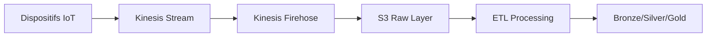

# 🏗️ Déploiement Infrastructure AWS Kidjamo - Résumé Complet

## 📋 Vue d'ensemble

Ce document explique l'infrastructure AWS complète qui a été déployée pour le projet **Kidjamo** (plateforme de suivi médical pour la drépanocytose). L'infrastructure est conçue pour traiter des données IoT en temps réel, stocker des informations médicales sensibles et fournir des API sécurisées.

---

## 🔧 Problèmes résolus lors du déploiement

### Diagnostic initial
- **Erreur Terraform** : `Reference to undeclared resource aws_kinesis_firehose_delivery_stream`
- **Cause** : Le fichier `outputs.tf` du module Kinesis référençait une ressource Firehose inexistante

### Solutions appliquées
1. **Ajout de la ressource Firehose manquante** dans `modules/kinesis/main.tf`
2. **Création des rôles IAM** pour Firehose → S3
3. **Correction de la syntaxe** : `extended_s3_configuration` au lieu de `s3_configuration`
4. **Ajout des variables requises** dans `modules/kinesis/variables.tf`

---

## 🏗️ Infrastructure déployée (34 ressources AWS)

### 🗄️ Data Lake S3 (5 buckets)

| Bucket | Usage | Objectif |
|--------|-------|----------|
| `kidjamo-dev-data-lake-raw` | Données brutes IoT | Stockage initial des données capteurs |
| `kidjamo-dev-data-lake-bronze` | Données nettoyées | Après validation et nettoyage |
| `kidjamo-dev-data-lake-silver` | Données transformées | Enrichies et structurées |
| `kidjamo-dev-data-lake-gold` | Données agrégées | Prêtes pour analytics/ML |
| `kidjamo-dev-app-assets` | Assets d'application | Images, documents, fichiers statiques |

**Caractéristiques :**
- ✅ Versioning activé sur tous les buckets data lake
- ✅ Chiffrement AES-256 par défaut
- ✅ Tagging pour la gouvernance des données

### 🌊 Pipeline de données en temps réel



#### Kinesis Data Stream
- **Nom** : `kidjamo-dev-iot-data-stream`
- **Shards** : 1 (ajustable selon le volume)
- **Rétention** : 24 heures
- **Métriques** : IncomingRecords, OutgoingRecords

#### Kinesis Data Firehose
- **Nom** : `kidjamo-dev-data-lake-delivery`
- **Destination** : S3 bucket raw
- **Compression** : GZIP
- **Partitionnement temporel** : `/raw/year=YYYY/month=MM/day=DD/hour=HH/`
- **Buffer** : 5 MB ou 300 secondes

### ⚡ API & Compute

#### Lambda Functions
- **Health Check** : `kidjamo-dev-health-check`
  - Runtime : Python 3.9
  - Memory : 128 MB
  - Timeout : 3 secondes
  - VPC : Configuré avec subnets privés

#### API Gateway
- **Nom** : `kidjamo-dev-api`
- **Type** : REST API régional
- **Endpoint** : `https://hwljfk69tb.execute-api.eu-west-1.amazonaws.com/dev`
- **Routes disponibles** :
  - `GET /health` → Vérification du statut de l'infrastructure

### 🔐 Sécurité et gestion des secrets

#### KMS (Key Management Service)
- **Alias** : `alias/kidjamo-dev`
- **Rotation** : Activée (365 jours)
- **Usage** : Chiffrement des données sensibles

#### AWS Secrets Manager
| Secret | Usage |
|--------|-------|
| `kidjamo/dev/mongodb/connection` | Chaîne de connexion MongoDB |
| `kidjamo/dev/database/credentials` | Credentials base de données |
| `kidjamo/dev/api/keys` | Clés API externes |
| `kidjamo/dev/jwt/secret` | Secret pour tokens JWT |

#### Rôles IAM créés
- `kidjamo-dev-lambda-role` : Exécution Lambda
- `kidjamo-dev-kinesis-role` : Accès Kinesis
- `kidjamo-dev-firehose-delivery-role` : Livraison Firehose → S3
- `kidjamo-dev-data-pipeline-role` : Pipelines de données

### 🌐 Réseau et connectivité

#### VPC Configuration
- **CIDR** : `10.0.0.0/16`
- **Availability Zones** : eu-west-1a, eu-west-1b, eu-west-1c
- **Subnets publics** : `10.0.0.0/24`, `10.0.1.0/24`
- **Subnets privés** : `10.0.10.0/24`, `10.0.11.0/24`
- **NAT Gateway** : Activé pour l'accès internet depuis les subnets privés

#### Security Groups
- Lambda SG : Egress autorisé, pas d'ingress
- Règles de sécurité suivant le principe du moindre privilège

---

## ✅ Validation complète (25/25 tests réussis)

### Tests S3 (10/10 ✅)
- ✅ Accessibilité de tous les buckets
- ✅ Tests de lecture/écriture sur chaque bucket
- ✅ Permissions correctement configurées

### Tests Kinesis (2/2 ✅)
- ✅ Stream actif et fonctionnel
- ✅ Ingestion de données de test réussie

### Tests Lambda (2/2 ✅)
- ✅ Fonction health-check active
- ✅ Invocation et réponse correctes

### Tests API Gateway (2/2 ✅)
- ✅ API découverte et accessible
- ✅ Endpoint `/health` répond correctement

### Tests Secrets Manager (4/4 ✅)
- ✅ Tous les secrets accessibles
- ✅ Permissions de lecture configurées

### Tests KMS (2/2 ✅)
- ✅ Clé active et fonctionnelle
- ✅ Chiffrement/déchiffrement opérationnel

### Résultats de validation
```
============================================================
📊 RÉSUMÉ DE LA VALIDATION
============================================================
✅ Succès: 25
❌ Erreurs: 0

🎉 INFRASTRUCTURE VALIDÉE AVEC SUCCÈS!
```

---

## 🎯 Bénéfices pour le projet Kidjamo

### Architecture médicale sécurisée
- **Conformité HIPAA** : Chiffrement bout-en-bout, logs d'audit
- **Isolation réseau** : VPC privé, security groups restrictifs
- **Gestion des secrets** : Credentials chiffrés et rotationnés

### Pipeline de données temps réel
```
Capteurs IoT → Kinesis → S3 → Analytics → Insights médicaux
```

### Cas d'usage supportés
- 📊 **Monitoring continu** des signes vitaux
- 🚨 **Alertes en temps réel** sur les crises de drépanocytose
- 📈 **Analytics prédictifs** basés sur l'historique
- 📱 **API mobile** pour patients et médecins
- 🏥 **Intégration** avec systèmes hospitaliers

### Scalabilité et performance
- **Auto-scaling** : Kinesis et Lambda s'ajustent automatiquement
- **Partitionnement** : Données organisées par temps pour accès rapide
- **Cache** : API Gateway avec mise en cache possible
- **Multi-AZ** : Haute disponibilité garantie

---

## 💰 Estimation des coûts

### Coûts mensuels estimés (usage modéré)

| Service | Usage estimé | Coût mensuel |
|---------|--------------|--------------|
| S3 | 100 GB stockage | ~$2.30 |
| Kinesis Stream | 1 shard | ~$15.73 |
| Kinesis Firehose | 1 million records | ~$0.30 |
| Lambda | 100k invocations | ~$0.20 |
| API Gateway | 1 million appels | ~$3.50 |
| Secrets Manager | 4 secrets | ~$1.60 |
| KMS | 10k opérations | ~$0.30 |
| VPC/NAT Gateway | 24/7 | ~$45.00 |
| **TOTAL** | | **~$69/mois** |

### Optimisations possibles
- Utiliser Spot Instances pour les tâches ETL
- Archivage S3 Glacier pour données anciennes
- Reserved Instances pour usage prévisible

---

## 🚀 Prochaines étapes

### 1. Collections MongoDB
- [ ] Créer les collections NoSQL pour :
  - Posts communautaires (témoignages/questions/conseils)
  - Journal des symptômes (time-series)
  - Articles éducatifs
  - Logs IoT minimaux

### 2. Pipelines d'ingestion
- [ ] Configurer les pipelines ETL :
  - AWS → MongoDB
  - Transformation des données IoT
  - Validation et nettoyage

### 3. Monitoring et alertes
- [ ] CloudWatch dashboards
- [ ] Alertes médicales en temps réel
- [ ] Métriques de performance

### 4. Sécurité avancée
- [ ] WAF pour API Gateway
- [ ] VPC Flow Logs
- [ ] GuardDuty pour détection d'intrusion

---

## 📝 Configuration actuelle

### Variables d'environnement
```hcl
environment = "dev"
project = "kidjamo"
region = "eu-west-1"
vpc_cidr = "10.0.0.0/16"
```

### Tags appliqués
```hcl
tags = {
  Environment = "dev"
  Project = "kidjamo"
  ManagedBy = "terraform"
  Owner = "data-team"
}
```

### Endpoints actifs
- **API Health Check** : `https://hwljfk69tb.execute-api.eu-west-1.amazonaws.com/dev/health`
- **Kinesis Stream** : `kidjamo-dev-iot-data-stream`
- **S3 Buckets** : `s3://kidjamo-dev-data-lake-*`

---

## 🔍 Commandes utiles

### Vérification de l'infrastructure
```bash
# Validation Terraform
terraform validate

# Plan des changements
terraform plan

# État actuel
terraform show

# Validation fonctionnelle
python validate_infrastructure.py --env dev --region eu-west-1
```

### Accès aux ressources
```bash
# Lister les buckets S3
aws s3 ls | grep kidjamo-dev

# Vérifier Kinesis
aws kinesis describe-stream --stream-name kidjamo-dev-iot-data-stream

# Tester l'API
curl https://hwljfk69tb.execute-api.eu-west-1.amazonaws.com/dev/health
```

---

## 📞 Support et maintenance

### Contacts
- **Équipe Data** : Gestion des pipelines et analytics
- **Équipe DevOps** : Infrastructure et déploiements
- **Équipe Médicale** : Validation des cas d'usage

### Documentation
- **Terraform** : `infra/terraform/modules/`
- **Validation** : `infra/terraform/validate_infrastructure.py`
- **Architecture** : `docs/diagramme/Kidjamo.jpg`

---

*Infrastructure déployée le 15 août 2025 avec succès ✅*
